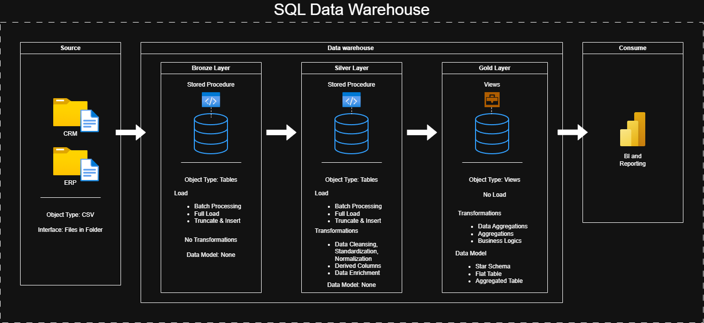
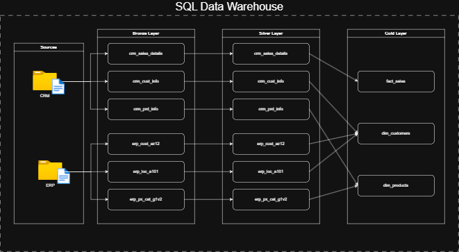
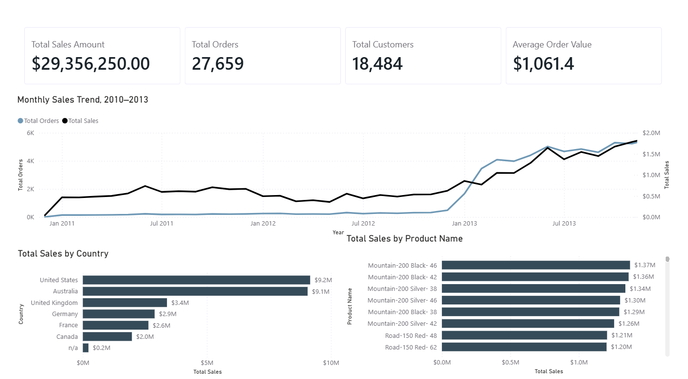
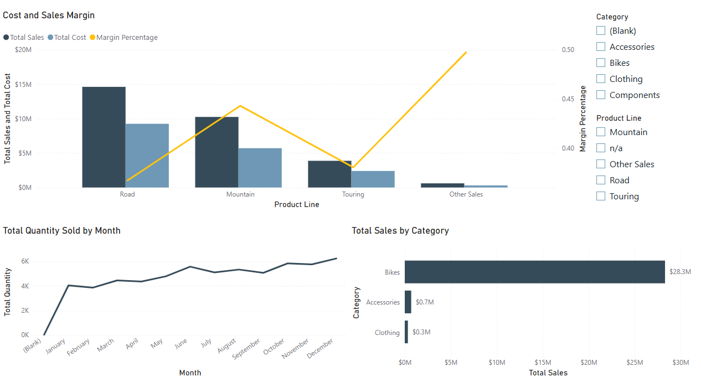
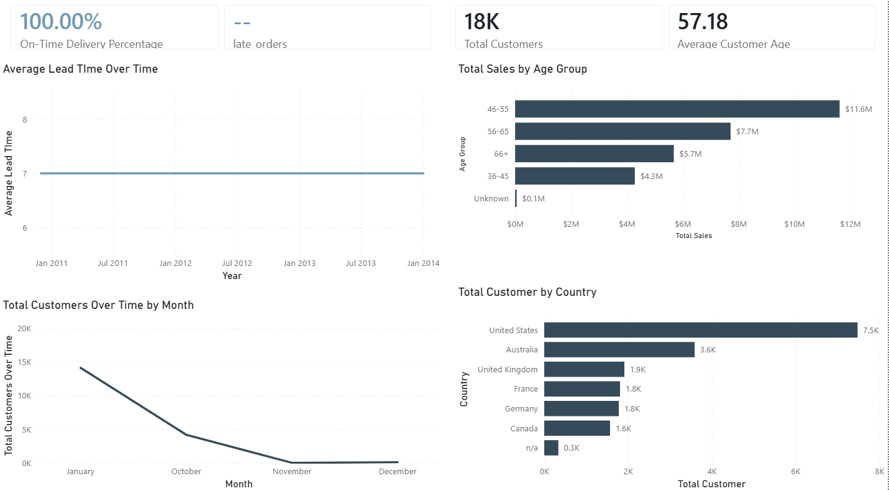

# Integrated ERP/CRM SQL Data Warehouse & BI Analytics Pipeline 🏗️

An end-to-end Medallion data warehouse built in SQL Server. It consolidates ERP and CRM transactional data into one analytics-ready star schema. Built as a portfolio project to show core SQL data engineering skills.


---

## 📖 Overview

This project consolidates two source systems into one model. ERP and CRM data arrives as raw CSV exports. The pipeline follows a Bronze/Silver/Gold Medallion architecture inside SQL Server. There is no cloud dependency. The focus stays on SQL fundamentals like joins, window functions, dynamic SQL and dimensional modeling.

**This project demonstrates:**

- Bronze/Silver/Gold Medallion architecture in T-SQL
- ETL logic using CTEs, window functions and dynamic SQL
- Deduplication and normalization across two source systems
- Star schema design for analytical queries
- Query tuning through indexing and execution plan review

---

## 🏗️ Data Architecture



## 🏗️ Data Flow



1. **Bronze Layer**: Raw ERP and CRM data loaded as-is. No transformation.
2. **Silver Layer**: Cleansing and normalization. Conflicts between the two sources get resolved here.
3. **Gold Layer**: Star schema with fact and dimension tables. Includes reporting views and stored procedures.

---

## 🛠️ Tech Stack & Rationale

| Tool               | Role                  | Why It's Used                                        |
| ------------------ | --------------------- | ---------------------------------------------------- |
| SQL Server Express | Database engine       | Free and lightweight RDBMS for warehousing           |
| SSMS               | Development and admin | Query development and execution plan analysis        |
| T-SQL              | Transformation logic  | Cleansing done in-database with no external ETL tool |
| Star Schema        | Data modeling         | Built for analytical queries, not transactional ones |
| DrawIO             | Documentation         | Architecture and data model diagrams                 |

---

## 📸 Screenshots

<!-- Keep this to 2-4 images in docs/screenshots/. Priority: final Gold report output first, then a passing test/validation shot, then one pipeline run. Skip code screenshots, use real code blocks instead. -->

### Gold layer output





---

## 📂 Repository Structure

```
data-warehouse-project/
│
├── datasets/                    # Raw ERP and CRM data (CSV)
├── docs/
│   ├── data_architecture.drawio
│   ├── data_catalog.md
│   ├── data_flow.drawio
│   └── naming-conventions.md
├── scripts/
│   ├── bronze/
│   ├── silver/
│   └── gold/
├── tests/
├── README.md
├── LICENSE
└── .gitignore
```

---

## 🚀 Getting Started

### Prerequisites

- SQL Server Express
- SQL Server Management Studio (SSMS)

### Setup

```
1. Create the database in SSMS
2. Run scripts/bronze/ to load raw ERP and CRM CSVs
3. Run scripts/silver/ to cleanse and normalize
4. Run scripts/gold/ to build the star schema and views
```

---

## 🎯 Key Technical Decisions

- **T-SQL only, no external ETL tool.** This keeps the project focused on SQL depth over tool orchestration.
- **Star schema over a normalized model.** It fits the actual query patterns for sales and customer analysis better.
- **Latest snapshot only, no historization.** This kept scope focused. Historization is a natural next step.
- **Indexing driven by execution plans.** Indexes got added based on observed costs, not guesswork.

---

## 📊 Results / Metrics

- [Row counts processed across ERP and CRM sources]
- [Number of Gold layer views and stored procedures]
- [Measured query improvement from indexing, if benchmarked]

---

## 🧰 Skills Demonstrated

`SQL Server` `T-SQL` `CTEs` `Window Functions` `Dynamic SQL` `Star Schema Design` `Dimensional Modeling` `Query Optimization` `Indexing` `Partitioning` `Medallion Architecture`

---

## 📄 License

MIT. See [`LICENSE`](LICENSE).
